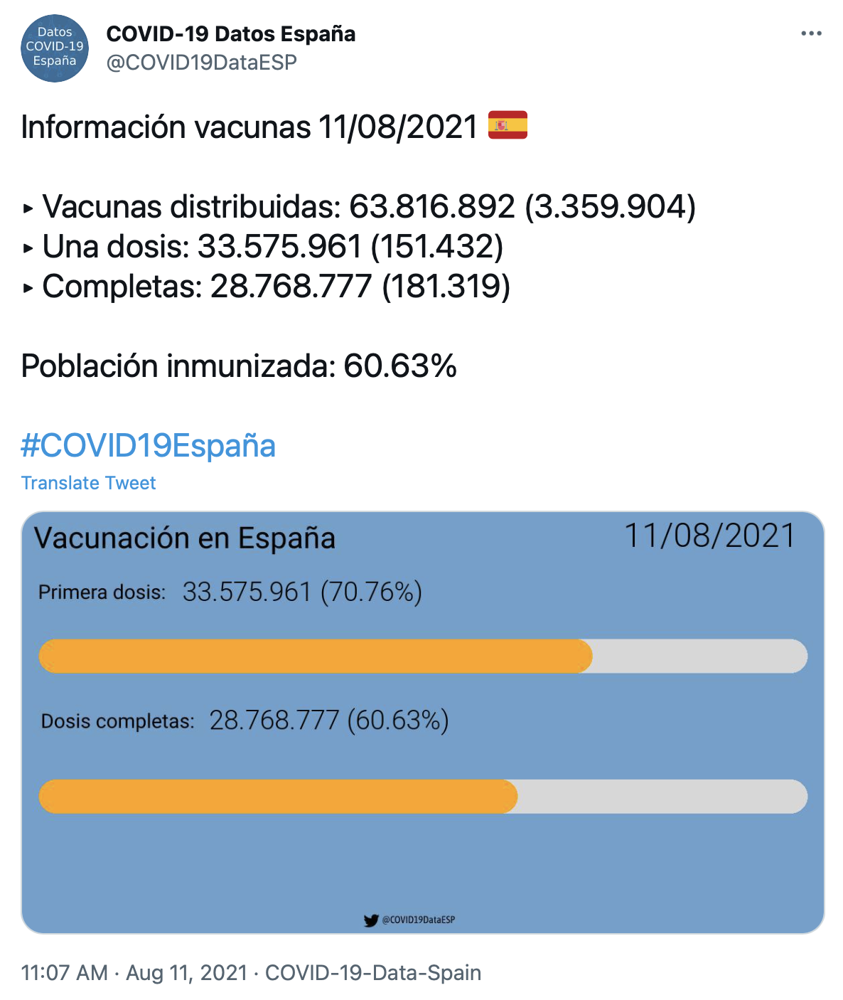

# COVID-19 Data Twitter Spain

[Readme en español](README.md)

Twitter bot to publish data about COVID-19 cases, deaths and vaccines on Twitter.

## Data sources

* Cases and deaths: https://www.worldometers.info/coronavirus/country/spain/
* Vaccination: https://www.mscbs.gob.es/profesionales/saludPublica/ccayes/alertasActual/nCov/vacunaCovid19.htm

## Twitter user

[@COVID19DataESP](https://twitter.com/COVID19DataESP)

## Examples

Here are some examples of the tweets that get published every day (except weekends) in the Twitter account:

</img>
</img>

## Pull requests

Pull requests are very much welcome since I don't have much time for this project.

Just have in mind these few points:
* **Don't create big PRs:** Reviewing and merging smaller pull requests is easier and faster.
* **Follow the coding style:** I use Flake8 to style my Python code. There are some VS Code extensions to have the editor highlight when you are not following the style guide. Here are the rules anyway: https://www.flake8rules.com
* **Don't create a PR to refactor the folder structure or a big amount of code,** it will probably not be merged.

## Roadmap
 - [x] Add images to cases tweets
 - [x] Add images for the progress of vaccination
 - [ ] Get cases data per autonomous community and tweet it in the form of a thread
 - [ ] Get vaccination data per autonomous community and tweet it in the form of a thread
